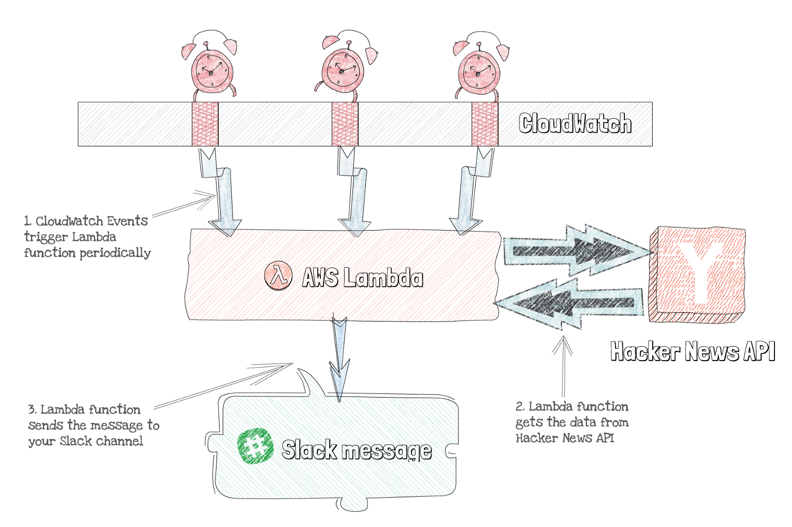
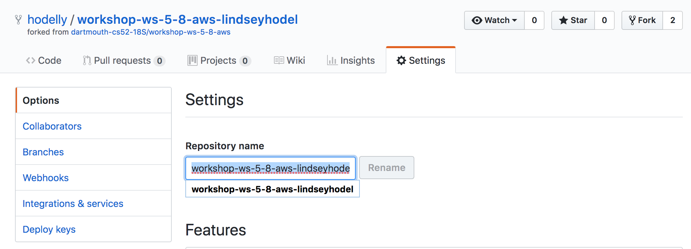
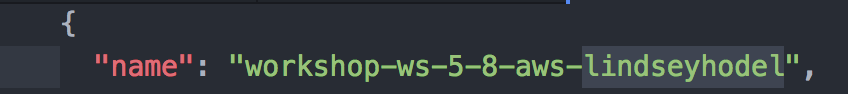

# CS52 Workshops:  AWS (Amazon Web Services) Workshop


Authors: Katherine Bernardez, Robert Crawford, Alexander Danilowicz, Lindsey Hodel, Stephen Liao

## Overview
We are making a SlackBot that sends you the five latest stories from [Hacker News](https://news.ycombinator.com/). Here is an abstract diagram of what we are doing.


*This image is from this [Medium article](https://medium.freecodecamp.org/scheduling-slack-messages-using-aws-lambda-e56a8eb22818), which we based our workshop off of because it's so awesome!*

* [ ] Create an AWS Account
* [ ] Set up Claudia
* [ ] Deploy a Lambda function to the cloud
* [ ] How to integrate APIs (in this case Hacker News) with AWS
* [ ] How to configure `awscli`
* [ ] How to be an AWS god.

## Setup
As usual, fork this repo!

Change the name of the directory to `workshop-ws-5-8-aws-YOUR-NAME`.


Also change the name in `package-lock.json` and `package.json` to match your project directory name.


:thought_balloon: You need to do this because when Claudia uploads the Lambda function to AWS, it uses the directory name as the function name and if everyone has the same directory name then there will be conflicting function names and no one will be able to deploy.

### Sign up for a free AWS account
Click [here](https://aws.amazon.com/) and then on Create A Free Account. Enter your information. We chose Personal Account, but it should not matter. You will have to enter your credit card information, because after the first 12 months AWS starts to bill you (do not worry we will cancel our account at the end of class).

## Step by Step

### Download AWS-CLI
`pip install awscli`

### Configure AWS-CLI with your proper credentials
In the top right click on your account name and then on My Security Credentials.


:thought_balloon: Normally you would want to get started with IAM users for security reasons, but since this is a quick workshop and we will be canceling our AWS account just click on Continue to Security Credentials.

Expand the Access keys tab and click on Create New Access Key. Hold on to the **access key** and **secret key**.


Run `aws configure`.

On the command line, enter your access key and secret key as they come up.

```
AWS Access Key Id = COPY-PASTE-YOUR-ACCESS-KEY
AWS Secret Key = COPY-PASTE-YOUR-SECRET-KEY
Default Region name = us-east-2
Default Output format = [don't worry about this, hit enter]
```

:heavy_exclamation_mark: Note that we are working in **us-east-2** as our region. (Fun fact: this is AWS center located in Ohio, which is closest to Hanover!)

### Download Claudia.js
:thought_balloon: Claudia.js is a nice package that allows us to treat infrastructure as code. It lets us take any function we write and upload it as a Lambda function. We could do this manually on AWS, by clicking around through a bunch of menus, but that wouldn't be very ~software engineer~ of us.

`npm install claudia -g`

### Set up Claudia.js
Open up your `~/.aws/credentials` file by running `atom ~/.aws/credentials` in terminal and make it look like this:

:heavy_exclamation_mark: Your current file should look like this:

```
[default]
aws_secret_access_id = INSERT-YOUR-ACCESS-KEY
aws_access_key_id = INSERT-YOUR-SECRET-KEY
```

:100: You should change it so it looks like this! In other words, replace `[default]` with `[claudia]`.

```
[claudia]
aws_secret_access_id = INSERT-YOUR-ACCESS-KEY
aws_access_key_id = INSERT-YOUR-SECRET-KEY
```

And then, set AWS_PROFILE environment variable to Claudia with the following command in your top-level project directory: `export AWS_PROFILE=claudia`.

To make sure that we did that correctly, run `echo $AWS_PROFILE` and it should return the value `claudia`.

### Configure Slack WebHooks
We have already provided you with the code, so no need to copy and paste :smile:

Now, to set up our Slack personal channel! Click [here](https://cs52-dartmouth.slack.com/apps/A0F7XDUAZ-incoming-webhooks?page=1), go to Add Configuration and in the drop down menu select Privately to yourself.


Click on Add Incoming WebHooks Integration, copy the Webhook URL and **replace** the current URL in `env.json`.

### Deploy to AWS with Claudia
```
claudia create --region us-east-2 --handler index.handler --timeout 10 --set-env-from-json env.json
```

You should now see `claudia.json` in your directory. It should look like this:

The "role" and "name" shouldn't match the below but they should be there.

```
{
  "lambda": {
    "role": "workshop-ws-5-8-aws-YOUR-NAME-executor",
    "name": "workshop-ws-5-8-aws-YOUR-NAME",
    "region": "us-east-2"
  }
}
```

Run:

`aws events put-rule --name hackerNewsDigest --schedule-expression 'cron(0/59 * * * ? *)'`

This sets the Slack message as an event to trigger every hour (potential extra credit could be for someone to make this trigger once a day rather than every hour).

Running the above command will output the `arn` of the task. The output will look something like:

```
{
    "RuleArn": "arn:aws:events:us-east-2:860157212032:rule/hackerNewsDigest"
}
```

Now, run this function with the RuleArn string in place of INSERT-YOUR-ARN and your project
directory name in place of workshop-ws-5-8-aws-YOUR-NAME.

:heavy_exclamation_mark: You run this function in your terminal, but we recommend editing this command in Atom or your favorite text editor, so you don't mess up the syntax!

```
aws lambda add-permission \
  --statement-id 'hackernews-scheduled-messages' \
  --action 'lambda:InvokeFunction' \
  --principal 'events.amazonaws.com' \
  --source-arn INSERT-YOUR-ARN \
  --function-name workshop-ws-5-8-aws-YOUR-NAME \
  --region us-east-2
```

`ruleArn` is the output from the `aws events...` command. `function-name` can also be found by going to the AWS console -> services -> lambda -> Functions.

Run `claudia test-lambda` and you should receive an update.

Now, let's test it! Run `claudia test-lambda`. You should see a slack message in your personal channel!


It should look like this!

.

:tada: You're all done! :tada:

### Close your AWS Account

:heavy_exclamation_mark: There is no reason you should get billed, but better safe than sorry. Since we do not want you to get billed, close your account! Go to My Account and at the bottom of the page click **Close Account**. :moneybag:

## Summary / What you Learned
* [x] Create an AWS Account
* [x] Set up Claudia
* [x] Deploy a Lambda function to the cloud
* [x] How to integrate APIs (in this case Hacker News) with AWS
* [x] How to configure `awscli`
* [x] How to be an AWS god.


## Extra Credit
The world is your oyster!

* [x] Use a different news API

## Resources
* [Medium Article with a similar workshop](https://medium.freecodecamp.org/scheduling-slack-messages-using-aws-lambda-e56a8eb22818)
* [AWS Homepage](https://aws.amazon.com/)
